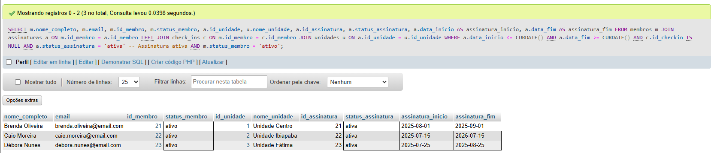
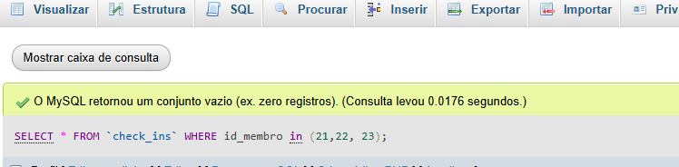
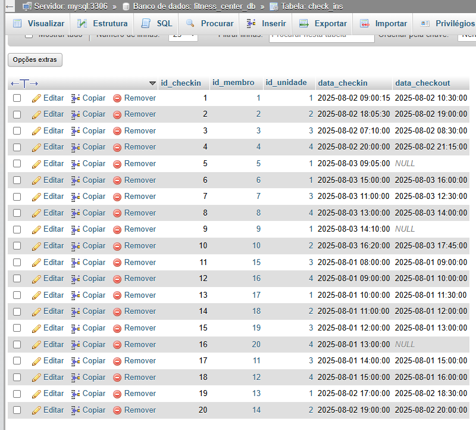

# 📋 Membros Ativos com Assinatura Ativa sem Check-in

> Apresenta todos os membros que estão com o **status ativo**, possuem **assinatura ativa**, mas **nunca realizaram check-in** em nenhuma unidade da academia.

## 🎯 Critérios de Seleção

- Membros com `status_membro = 'ativo'`
- Assinaturas com:
  - `status_assinatura = 'ativa'`
  - Vigência válida (`data_inicio <= CURDATE()` e `data_fim >= CURDATE()`)
- Sem nenhum registro de check-in (`c.id_checkin IS NULL`)

## 📌 Relação entre as tabelas membros, assinatura, unidade e check-in:
---
- CREATE TABLE unidades (
  id_unidade INT PRIMARY KEY AUTO_INCREMENT, -- Identificador único para cada unidade
  
  nome_unidade VARCHAR(60) NOT NULL, -- Nome da unidade de fitness
  
  endereco VARCHAR(150) NOT NULL, -- Endereço físico da unidade
  
  horario_funcionamento VARCHAR(30) NOT NULL, -- Horário de funcionamento da unidade
  
  capacidade_maxima INT NOT NULL, -- Capacidade máxima
  
  ativa BOOLEAN DEFAULT TRUE, -- Indica se a unidade está ativa
  );

  - CREATE TABLE membros (
  id_membro INT PRIMARY KEY AUTO_INCREMENT, -- Identificador único para cada membro
  
  nome_completo VARCHAR(80) NOT NULL, -- Nome completo do membro
  
  email VARCHAR(60) UNIQUE NOT NULL, -- E-mail único do membro
  
  telefone VARCHAR(15) NOT NULL, -- Telefone de contato do membro.
  
  data_nascimento DATE NOT NULL, -- Data de nascimento
  
  data_cadastro DATE DEFAULT (CURDATE()), --Data de cadastro  
  
   status_membro ENUM('ativo', 'suspenso', 'cancelado') DEFAULT 'ativo'-- Status do membro.
  );

  -  CREATE TABLE check_ins (
   id_checkin INT PRIMARY KEY AUTO_INCREMENT,  -- Identificador único para cada check-in
   
   id_membro INT NOT NULL,                      -- Referência ao membro que realizou o check-in
   
   id_unidade INT NOT NULL,                     -- Referência à unidade onde o check-in foi realizado
   
   data_checkin DATETIME DEFAULT CURRENT_TIMESTAMP,  -- Data e hora em que o membro fez o check-in
   
   data_checkout DATETIME,                     -- Data e hora em que o membro fez o check-out (quando aplicável)
   
   FOREIGN KEY (id_membro) REFERENCES membros(id_membro),  -- Relaciona ao membro na tabela 'membros'
   
   FOREIGN KEY (id_unidade) REFERENCES unidades(id_unidade)  -- Relaciona à unidade na tabela 'unidades'
      );
 
### Explicação: é possível ter um membro associado a uma unidade sem que ele tenha realizado nenhum check-in

- Relação entre Membros e Unidades:
  Não há uma obrigação automática que exige que um membro, ao ser associado a uma unidade, faça um check-in nessa unidade.

- A relação entre os membros e unidades no banco de dados ocorre de maneira indireta. Os membros podem ter assinaturas ativas em uma unidade, mas isso não implica que eles necessariamente precisem fazer um check-in.

- Membros com Assinaturas, mas Sem Check-ins:

A tabela assinaturas ( associando membros e unidades) pode vincular um membro a uma unidade, mas o check-in (registrado na tabela check_ins) é voluntário. Ou seja, o membro pode ter uma assinatura ativa na unidade, mas ainda não ter registrado um check-in.

## 📌 Consulta SQL:

---

    SELECT
        m.nome_completo,
        m.email,
        m.id_membro,
        m.status_membro,
        a.id_unidade,
        u.nome_unidade,
        a.id_assinatura,
        a.status_assinatura,
        a.data_inicio AS assinatura_inicio,
        a.data_fim AS assinatura_fim
    FROM
        membros m
    JOIN
        assinaturas a ON m.id_membro = a.id_membro
    LEFT JOIN
        check_ins c ON m.id_membro = c.id_membro
    JOIN
        unidades u ON a.id_unidade = u.id_unidade
    WHERE
        a.data_inicio <= CURDATE()
        AND a.data_fim >= CURDATE()
        AND c.id_checkin IS NULL
        AND a.status_assinatura = 'ativa'   -- Assinatura ativa
        AND m.status_membro = 'ativo';      -- Membro ativo

---

- A junção com `check_ins` é feita via **LEFT JOIN**, permitindo identificar membros **sem registros de check-in**.
- Apenas registros com **assinatura vigente** são considerados (data atual entre início e fim).

## 🗃️ Colunas Selecionadas

| Campo               | Descrição                                      |
| ------------------- | ---------------------------------------------- |
| `nome_completo`     | Nome completo do membro                        |
| `email`             | E-mail de contato do membro                    |
| `id_membro`         | Identificador único do membro                  |
| `status_membro`     | Status atual do membro (esperado: 'ativo')     |
| `id_unidade`        | ID da unidade vinculada à assinatura           |
| `nome_unidade`      | Nome da unidade vinculada à assinatura         |
| `id_assinatura`     | Identificador da assinatura                    |
| `status_assinatura` | Status atual da assinatura (esperado: 'ativa') |
| `assinatura_inicio` | Data de início da assinatura                   |
| `assinatura_fim`    | Data de término da assinatura                  |

## 📊 Resultado da Consulta:

- Liste o nome completo e email de todos os membros ativos que possuem assinatura ativa mas nunca fizeram check-in em nenhuma unidade.

  

- Os membros de ID (21, 22, 23) sem nenhum registro de check-in.

  

- Todos os check-in.
  
  
