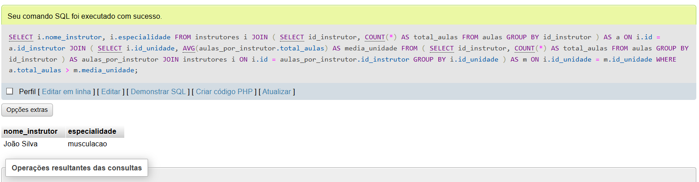
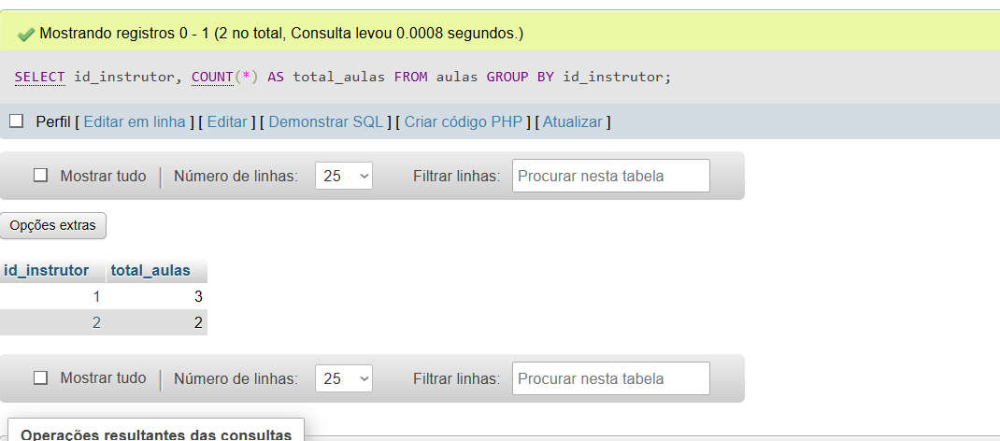
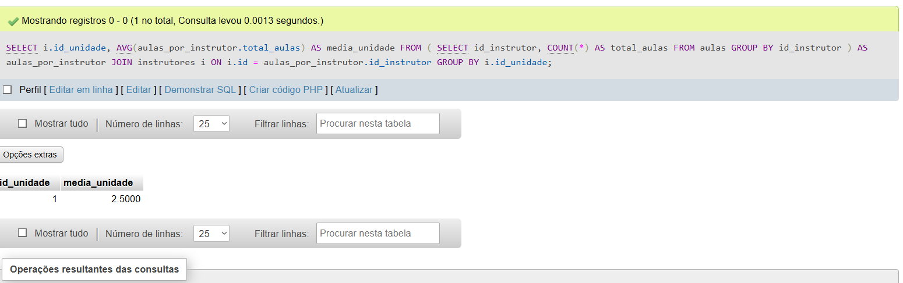

# 📋 Instrutores Acima da Média por Unidade

Identifica os instrutores que ministraram mais aulas do que a **média de aulas por instrutor** na sua respectiva **unidade**.

---

## 🎯 Critérios de Seleção

- Contagem total de aulas ministradas por cada instrutor (`total_aulas`)
- Cálculo da média de aulas por instrutor em cada unidade (`media_unidade`)
- Seleção dos instrutores cujo total de aulas é maior que a média da sua unidade

---

## 📌 Relação entre as Tabelas `instrutores`, `aulas` e `unidades`

- **instrutores**: contém dados pessoais e o ID da unidade onde cada instrutor atua.
- **aulas**: registra as aulas realizadas, com referência ao instrutor.
- Cada instrutor está vinculado a uma unidade (`id_unidade`), que permite agrupar e calcular médias por unidade.

---

## 🔗 Relacionamentos entre as tabelas

- A tabela **instrutores** possui a coluna `id_unidade`, indicando a qual unidade cada instrutor pertence.
- A tabela **aulas** possui as colunas `id_instrutor` e `id_unidade`, referenciando o instrutor que ministrou a aula e a unidade onde a aula ocorreu.
- A relação entre **instrutores** e **aulas** é feita por `instrutores.id = aulas.id_instrutor`.
- A relação entre **instrutores** e **unidades** é feita por `instrutores.id_unidade = unidades.id_unidade`.
- O agrupamento e comparação da quantidade de aulas são feitos por unidade, usando o `id_unidade` para garantir que a comparação seja feita apenas entre instrutores da mesma unidade.

---

## 📌 Consulta SQL:

```sql
SELECT i.nome_instrutor, i.especialidade
FROM instrutores i
JOIN (
    SELECT id_instrutor, COUNT(*) AS total_aulas
    FROM aulas
    GROUP BY id_instrutor
) AS a ON i.id = a.id_instrutor
JOIN (
    SELECT i.id_unidade, AVG(aulas_por_instrutor.total_aulas) AS media_unidade
    FROM (
        SELECT id_instrutor, COUNT(*) AS total_aulas
        FROM aulas
        GROUP BY id_instrutor
    ) AS aulas_por_instrutor
    JOIN instrutores i ON i.id = aulas_por_instrutor.id_instrutor
    GROUP BY i.id_unidade
) AS m ON i.id_unidade = m.id_unidade
WHERE a.total_aulas > m.media_unidade;

```
---

## 📊 Resultado da Consulta:

**1. Consulta principal que lista instrutores com mais aulas que a média da sua unidade.**



**2. Print da consulta do total de aulas por instrutor.**
- Subconsulta que conta quantas aulas cada instrutor ministrou.



**3. Print da consulta da média de aulas por unidade**
- Subconsulta que calcula a média de aulas dadas por instrutor em cada unidade.

